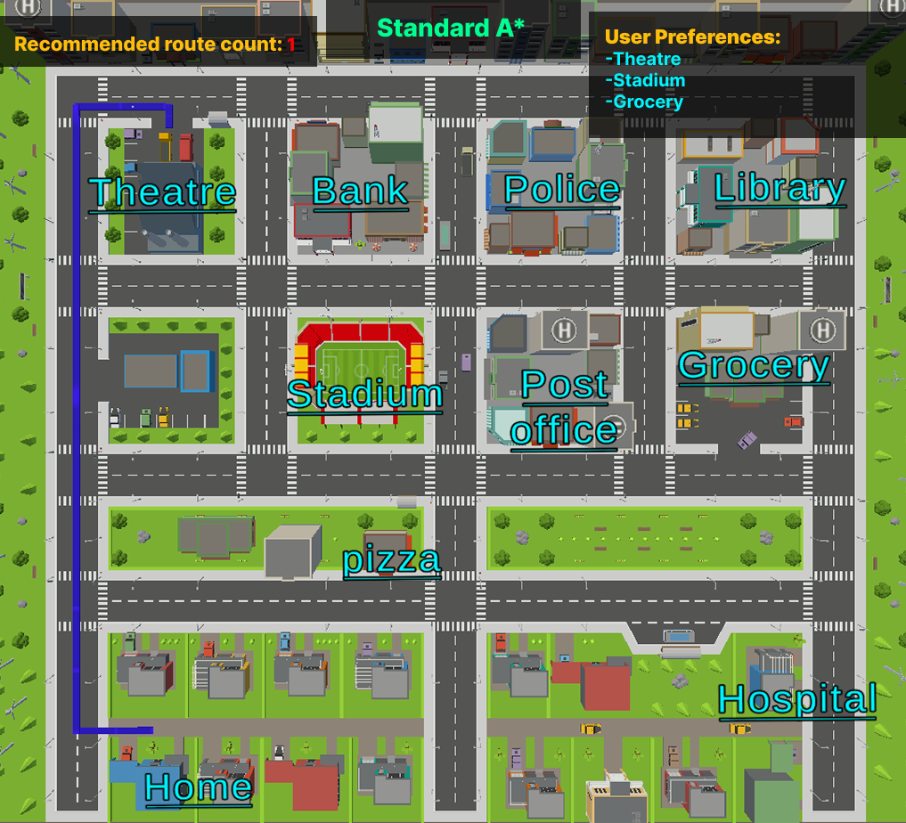
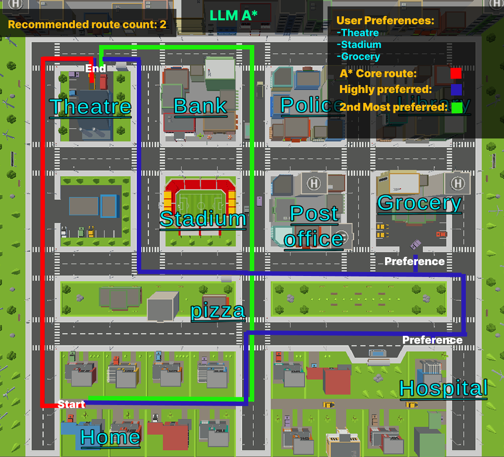

# LLM-Enhanced A* Pathfinding Algorithm

This project integrates a **Language Model (LLM)** with the **A*** algorithm to enhance pathfinding by incorporating user preferences. Unlike traditional A*, which finds the shortest path based purely on distance or cost, our approach dynamically adjusts routing based on user-defined criteria, enabling more personalized navigation solutions.

## 🚀 Features
- **Preference-Based Pathfinding**: Routes are optimized based on user constraints (e.g., safety, scenery, toll-free roads).
- **Multi-Level Neighbor Exploration**: Considers alternative paths beyond the shortest route.
- **LLM-Assisted Decision Making**: Uses natural language input to refine routing decisions.
- **Adaptive Cost Function**: Balances travel efficiency with user satisfaction.
- **Alternative Route Suggestions**: Provides diverse routing options rather than a single optimal path.

## 📌 Applications
- **Autonomous Navigation**: Enhances decision-making in self-driving vehicles.
- **Smart Travel Planning**: Personalized routing based on preferences (e.g., scenic routes, dining spots).
- **Logistics Optimization**: Adjusts delivery routes based on real-time preferences.
- **Emergency Routing**: Finds paths optimized for safety and accessibility.

## 🛠️ Installation
Ensure you have Python installed, then clone this repository:
```bash
git clone https://github.com/Coder-Dilip/preference-a-star-LLM.git
```

## 🏗️ Usage
Run the pathfinding algorithm by running each and every cell:
But first get Groq's API key from [Groq's API Documentation](https://console.groq.com/login)


## 📊 Results
| Feature | Traditional A* | Preference-Based A* |
|---------|---------------|---------------------|
| Path Flexibility | One Fixed Path | Multiple Paths Based on User Needs |
| User Preference Consideration | No | Yes |
| Alternative Route Options | No | Yes |
| Computational Efficiency | Fastest | Slightly More Expensive |

## 📷 Visualization
| **Standard A*** | **Preference-Based A*** |
|-----------------|------------------------|
|  |  |

## 🔍 Limitations & Future Improvements
- **Computational Cost**: Preference-aware pathfinding requires more processing power.
- **LLM Interpretation Accuracy**: The model's understanding of preferences can be improved.
- **Scalability**: Optimization required for large-scale real-time applications.

## 🤝 Contributing
Feel free to fork the repository and submit pull requests. Contributions are welcome!


